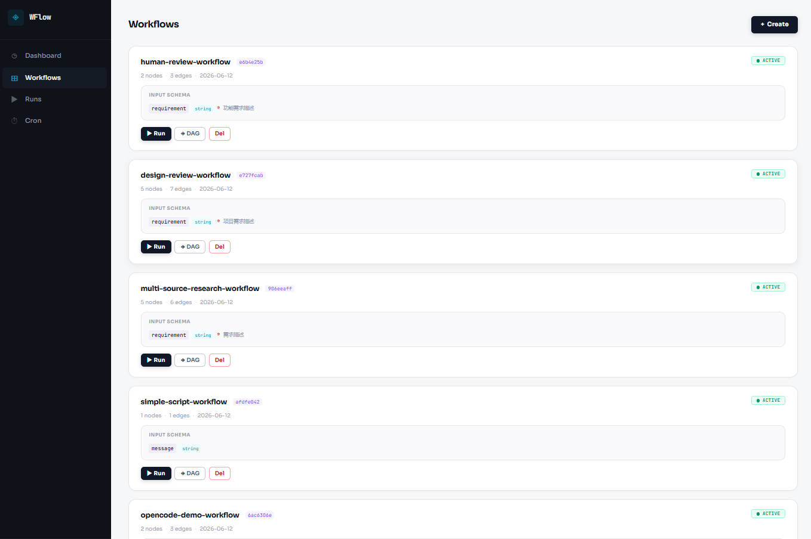
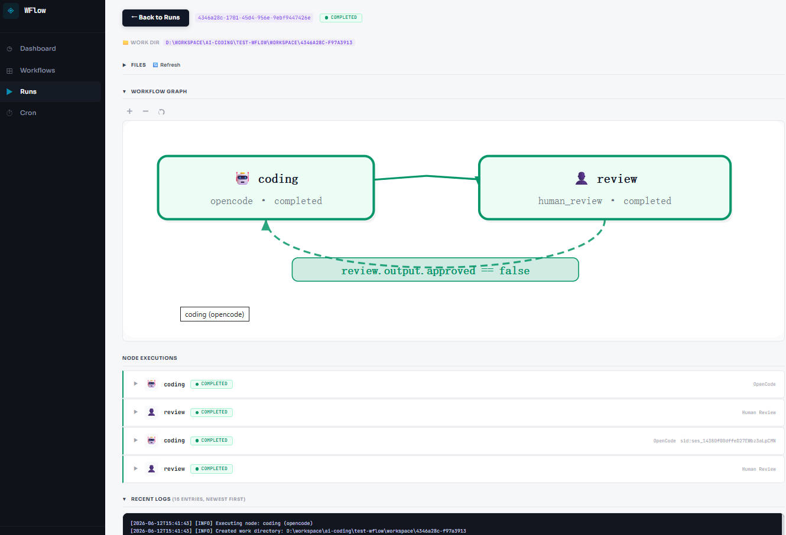
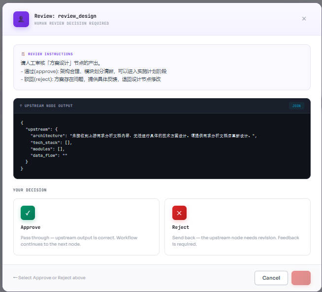
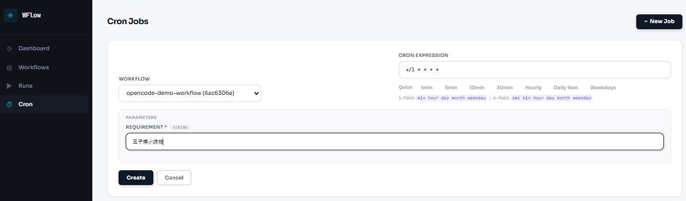

# WFlow — 工作流编排器

基于 Claude Code CLI / OpenCode CLI 的 AI 工作流编排工具。通过 JSON 定义工作流 DAG，支持条件分支、回路(Loop-back)、人工审核(Human Review)、Session 复用、断点续跑、定时触发。

## 安装

```bash
cd cc-workflow
pip install -e ".[dev]"
wflow --help
```

**前置依赖：** Python 3.11+，系统已安装 `claude` 和/或 `opencode` CLI 工具。

---

## 快速开始

```bash
# 1. 启动服务
wflow server start --port 8100

# 2. 导入工作流
wflow workflow create examples/code-review.json

# 3. 启动任务
wflow run start <workflow-id> --input requirement="编写一个 Python 计算器"

# 4. 查看状态（实时日志）
wflow run logs <run-id> --follow

# 5. 设置每天早上 9 点自动触发
wflow cron add <workflow-id> "0 9 * * *"

# 6. 打开 Web 界面
# → http://localhost:8100
```

---

## 工作流 JSON 配置

### 节点类型

支持 4 种节点类型：`claude`、`opencode`、`script`、`human_review`。

### Claude 节点

调用 Claude Code CLI，`prompt` 为纯角色/任务描述，系统自动注入上下文：

```json
{
  "id": "coding",
  "type": "claude",
  "prompt": "你是一个资深软件工程师。根据用户输入编写代码并写入文件。",
  "tools": { "allowed": ["Read","Write","Edit","Bash","Grep"] },
  "model": "deepseek-v4-pro",
  "output": {
    "type": "object",
    "properties": {
      "files_changed": { "type": "array", "items": { "type": "string" } },
      "summary": { "type": "string" }
    }
  },
  "retry": { "max_retries": 2 }
}
```

| 字段 | 说明 |
|------|------|
| `prompt` | 角色/任务描述（纯文本，系统自动注入上游输出和用户输入） |
| `tools.allowed` | 允许的工具 `["Read","Write","Edit","Bash","Grep"]` |
| `tools.disallowed` | 禁用的工具 |
| `model` | 模型名称（如 `sonnet`、`opus`、`deepseek-v4-pro`） |
| `output` | JSON Schema，Claude 必须输出符合此格式的 JSON |
| `retry.max_retries` | 失败重试次数 |

### OpenCode 节点

```json
{
  "id": "review",
  "type": "opencode",
  "prompt": "审查上游代码，输出审查意见。",
  "model": "deepseek-v4-pro",
  "output": {
    "type": "object",
    "properties": {
      "approved": { "type": "boolean" },
      "feedback": { "type": "string" }
    }
  },
  "retry": { "max_retries": 1 }
}
```

配置字段与 Claude 节点类似，但不支持 `tools` 配置。

### Script 节点

通过 subprocess 执行外部命令，stdin 传入上下文 JSON，stdout 捕获输出：

```json
{
  "id": "validate",
  "type": "script",
  "command": "python ./scripts/validate.py",
  "timeout_seconds": 60,
  "output": {
    "type": "object",
    "properties": { "passed": { "type": "boolean" } }
  }
}
```

| 字段 | 说明 |
|------|------|
| `command` | 要执行的命令 |
| `timeout_seconds` | 超时秒数（默认 300） |
| `output` | JSON Schema，脚本 stdout 必须匹配 |

脚本通过 stdin 接收：`{"inputs": {...}, "upstream": {...}, "nodes": {...}, "run": {...}}`

### Human Review 节点

人工审核节点——执行到该节点时 workflow 暂停，等待人工通过/驳回：

```json
{
  "id": "review_design",
  "type": "human_review",
  "prompt": "请审核上游设计方案。通过则进入下一阶段，驳回则退回设计节点修改。",
  "output": {
    "type": "object",
    "properties": {
      "approved": { "type": "boolean" },
      "feedback": { "type": "string" }
    }
  }
}
```

- **通过 (approved=true)**: 上游节点的产出透传到下一个节点（审批元数据 `approved`/`feedback` 也会保留）
- **驳回 (approved=false)**: 通过条件边 `{{ nodes.xxx.output.approved }} == false` 回路到上游重做
- 审核 API: `POST /runs/{id}/nodes/{node_id}/review` `{"approved": true, "feedback": ""}`
- 示例见 `examples/human-review-workflow.json`

### 条件分支

边 (edge) 上的 `condition` 支持 `{{ }}` 模板：

```json
{
  "edges": [
    { "from": "review", "to": "coding",
      "condition": "{{ nodes.review.output.approved }} == false" },
    { "from": "review", "to": null,
      "condition": "{{ nodes.review.output.approved }} == true" }
  ]
}
```

- 无 `condition` 的边为无条件边（始终可通行）
- `to: null` 表示终止（流程结束）
- 条件边按数组顺序求值，匹配的第一条生效

### 系统自动注入上下文

```
## 角色任务
<prompt原文>

## 用户输入           ← 首节点
{"requirement": "编写快排算法"}

## 上游节点输出        ← 后续节点
{"files_changed": [...], "summary": "..."}

## 上次输出错误        ← 重试时
No valid JSON found — 请修正后重新输出
```

### 模板变量

| 变量 | 示例 | 说明 |
|------|------|------|
| `{{ nodes.<id>.output.<key> }}` | `{{ nodes.review.output.approved }}` | 节点输出字段 |
| `{{ nodes.<id>.status }}` | `completed` | 节点状态 |
| `{{ inputs.<key> }}` | `{{ inputs.requirement }}` | 用户输入 |

### 完整示例

参见 `examples/` 目录：
- `examples/simple-script.json` — Script 单节点
- `examples/simple-opencode.json` — OpenCode 审查回路
- `examples/code-review.json` — Claude 代码审查回路
- `examples/complex-workflow.json` — 多起点+汇集+回路，含三种节点类型
- `examples/human-review-workflow.json` — Claude + 人工审核回路
- `examples/design-review-workflow.json` — 需求分析→设计→评审→计划→评审，双层人工审核

---

## CLI 命令参考

### 服务管理

```bash
wflow server start [--host 127.0.0.1] [--port 8100] [--db ./data/workflows.db]
```

### 工作流管理

```bash
wflow workflow list [--status active]
wflow workflow show <workflow-id>
wflow workflow create <file.json>
```

### 运行管理

```bash
wflow run start <workflow-id> [--input key=value ...] [--watch]
wflow run status <run-id>
wflow run pause <run-id>
wflow run resume <run-id>
wflow run stop <run-id>
wflow run logs <run-id> [--follow] [--level info]
```

### 定时任务

```bash
wflow cron list
wflow cron add <workflow-id> <cron-expr>
wflow cron toggle <cron-id>
wflow cron remove <cron-id>
```

**Cron 表达式：**

支持 5 字段（分钟级）和 6 字段（秒级）：

| 表达式 | 含义 |
|--------|------|
| `0 9 * * *` | 每天 9:00 |
| `*/5 * * * *` | 每 5 分钟 |
| `*/10 * * * * *` | 每 10 秒（6 字段） |
| `0 */6 * * *` | 每 6 小时 |
| `30 8 * * 1-5` | 工作日 8:30 |
| `0 0 1 * *` | 每月 1 号 |

---

## Skills 与脚本

wflow 启动时自动检测项目根目录下的 `.claude`、`.opencode`、`.wflow` 目录，并在每次 run 的工作目录中创建**拷贝或符号链接**：

```
项目根目录/
├── .claude/
│   ├── settings.json      # Claude Code 配置
│   ├── CLAUDE.md          # 项目级别指令（Claude 自动读取）
│   └── skills/            # 自定义 skills
├── .opencode/
│   └── opencode.json      # OpenCode 配置
└── .wflow/
    └── validate.py        # 自定义脚本 / 工具
```

### 工作原理

1. 服务启动时通过 `WFLOW_PROJECT_DIR` 环境变量（默认当前目录）检测上述目录
2. 每次创建 run 工作目录时，将检测到的目录**复制或符号链接**进去
3. 工作目录内的 Claude/OpenCode 节点可直接使用项目 skills、配置和脚本

### 配置方式

```bash
# 方式 1: 在项目根目录启动服务（自动检测当前目录）
cd my-project
wflow server start --port 8100

# 方式 2: 显式指定项目目录
wflow server start --port 8100 --project-dir /path/to/project

# 方式 3: 环境变量
WFLOW_PROJECT_DIR=/path/to/project wflow server start
```

### 使用场景

| 场景 | 配置方式 |
|------|---------|
| Claude 节点触发 skill | 项目根目录下放置 `.claude/skills/` 或 `.claude/CLAUDE.md` |
| OpenCode 节点使用配置 | 项目根目录下放置 `.opencode/opencode.json` |
| Script 节点引用脚本 | `"command": "python .wflow/validate.py"`（脚本放在 `.wflow/` 下）|

> **注意：** 拷贝发生在 run 创建时。如果更新了 skill 或配置，需要**重新启动 run** 才会生效。

---

## Web UI

启动服务后访问 `http://localhost:8100`。

### 页面概览

| 页面 | 功能 |
|------|------|
| Dashboard | 运行中/已完成/失败工作流统计 |
| Workflows | 列表、JSON 创建、一键启动、**DAG 拓扑图预览** |
| Runs | 运行列表、**DAG 状态图(支持 Ctrl+滚轮缩放/拖拽)**、节点执行详情、工作目录文件浏览、日志查看 |
| Cron | 定时任务管理：**动态参数表单**、Cron 预设、启用/禁用 |

### Workflows 页面



1. 点击 **+ Create** 粘贴 JSON 创建工作流
2. 每个工作流卡片显示节点数、边数、输入 Schema
3. 点击 **▶ Run** → 弹窗填写参数 → 启动
4. 点击 **◈ DAG** → 查看工作流拓扑图
5. 点击 **Del** → 删除

### Runs 页面



1. 点击运行记录旁的 **Details** 进入详情
2. **Workflow Graph**: 展开查看 DAG 状态图
   - 绿色节点 = 已完成，橙色 = 运行中，紫色 = 等待审核
   - 绿色边 = 已通过路径，灰色虚线 = 回路
   - **Ctrl + 滚轮** 缩放，鼠标拖拽平移
3. **Files**: 左侧文件树浏览器，右侧文件内容查看，支持拖动分隔条调整宽度
4. **Node Executions**: 折叠展开每个节点的执行详情（输入/输出/错误）
5. **Recent Logs**: 最新日志在上，textarea 展示，支持滚动

### 人工审核

<!-- TODO: 截图审核弹窗 -->


当工作流执行到 `human_review` 节点时：
1. Runs 页面该 run 旁出现 **Review** 按钮
2. 点击进入审核弹窗，查看上游产出和审核说明
3. 选择 **Approve**（通过）或 **Reject**（驳回）
4. 驳回需填写反馈意见，上游节点将根据反馈重做

### Cron 页面

<!-- TODO: 截图 cron 创建表单 -->


1. 点击 **+ New Job** 展开创建表单
2. **Workflow** 下拉选择 → 自动加载该工作流的输入 Schema，每个参数独立填写
3. **Cron Expression**: 点击预设按钮（5min / Hourly / Daily 9am 等）快速填入，也支持手动输入 5 或 6 字段表达式
4. 表格中点击 **Latest Run** 列的 run ID 可跳转查看运行详情
5. **Pause / Resume** 启用/禁用定时任务

---

## REST API

| 方法 | 路径 | 说明 |
|------|------|------|
| `GET` | `/api/v1/status` | 服务器状态 |
| `POST` | `/api/v1/workflows` | 创建工作流 |
| `GET` | `/api/v1/workflows` | 工作流列表 |
| `GET` | `/api/v1/workflows/{id}` | 工作流详情 |
| `POST` | `/api/v1/runs` | 启动任务 |
| `GET` | `/api/v1/runs` | 任务列表 |
| `GET` | `/api/v1/runs/{id}` | 任务详情（含节点状态/DAG/日志） |
| `GET` | `/api/v1/runs/{id}/files` | 浏览工作目录文件 |
| `GET` | `/api/v1/runs/{id}/files/content?path=` | 读取文件内容 |
| `POST` | `/api/v1/runs/{id}/pause` | 暂停 |
| `POST` | `/api/v1/runs/{id}/resume` | 恢复 |
| `POST` | `/api/v1/runs/{id}/stop` | 停止 |
| `POST` | `/api/v1/runs/{id}/rerun` | 重新运行 |
| `DELETE` | `/api/v1/runs/{id}` | 删除 |
| `GET` | `/api/v1/runs/{id}/logs` | 查看日志 |
| `POST` | `/api/v1/runs/{id}/nodes/{nid}/review` | 提交人工审核 |
| `POST` | `/api/v1/cron` | 创建定时任务 |
| `GET` | `/api/v1/cron` | 定时任务列表 |
| `GET` | `/api/v1/cron/{id}` | 定时任务详情 |
| `POST` | `/api/v1/cron/{id}/toggle` | 启用/禁用 |
| `DELETE` | `/api/v1/cron/{id}` | 删除 |
| `POST` | `/api/v1/cron/{id}/trigger` | 手动触发 |

访问 `http://localhost:8100/docs` 查看交互式 Swagger 文档。

---

## 架构

```
wflow server start
    └─ FastAPI
        ├─ APScheduler → 定时触发 WorkflowRun
        ├─ NodeHandler (ABC)
        │   ├─ ClaudeHandler → ClaudeCLI subprocess (stream-json)
        │   ├─ OpenCodeHandler → OpenCodeCLI subprocess (json)
        │   ├─ ScriptHandler → ScriptRunner subprocess (stdin/stdout)
        │   └─ HumanReviewHandler → 暂停等待审核
        ├─ WorkflowExecutor → DAG 拓扑遍历 + 回路检测
        └─ SQLite (aiosqlite) → 持久化
```

### 核心设计

| 概念 | 说明 |
|------|------|
| **NodeHandler 继承体系** | `NodeHandler` ABC → `ClaudeHandler` / `OpenCodeHandler` / `ScriptHandler` / `HumanReviewHandler`，新增类型只需子类化 |
| **Session 复用** | 每个 (run_id, node_id) 一个固定 session。回路重入同一节点时自动 Resume |
| **回路检测** | 基于无条件边构建 ancestor 关系，条件边仅当 target 是 source 的祖先时才触发 staleness |
| **流式日志** | Claude/OpenCode 使用 `stream-json` 输出，实时记录工具调用和状态 |
| **工作目录隔离** | 每个 run 创建 `workspace/<run_id[:8]>-<uuid>` 独立目录，自动拷贝项目的 `.claude`/`.opencode`/`.wflow` 配置 |
| **条件分支** | Edge `condition` 支持 `==`/`!=` 比较，模板变量引用上游输出 |
| **断点续跑** | 任务状态和 work_dir 持久化到 DB，支持重跑和恢复 |
| **人工审核透传** | `human_review` approved 时将上游节点真实产出传递到下游 |

### 项目结构

```
src/wflow/
├── main.py            # FastAPI 应用工厂 + scheduler 生命周期
├── api/               # REST API (status, workflows, runs, cron)
├── cli/               # Click CLI
├── engine/            # 核心引擎
│   ├── executor.py        # DAG 拓扑遍历 + 回路检测
│   ├── node_handler.py    # NodeHandler ABC + 4 个处理器
│   ├── node_runner.py     # 处理器派发
│   ├── scheduler.py       # Cron 调度
│   ├── session_manager.py # Session 管理
│   ├── state_machine.py   # 状态机
│   └── template.py        # {{ }} 模板解析
├── adapters/          # 外部适配器 (claude_cli, opencode_cli, script_runner)
├── models/            # Pydantic + SQLAlchemy 模型
├── services/          # 业务逻辑层
└── web/               # Alpine.js SPA
```

### 环境变量

| 变量 | 默认值 | 说明 |
|------|--------|------|
| `WFLOW_DB_URL` | `sqlite+aiosqlite:///./data/workflows.db` | 数据库路径 |
| `WFLOW_RUNS_DIR` | `./workspace` | 工作目录根路径 |
| `WFLOW_SERVER_URL` | `http://localhost:8100` | CLI 连接地址 |
| `WFLOW_PROJECT_DIR` | 当前目录 | 项目根目录(.claude/.opencode/.wflow 检测) |

---

## 运行测试

```bash
pytest tests/ -v
pytest tests/test_engine/ -v
pytest tests/test_adapters/ -v
```
